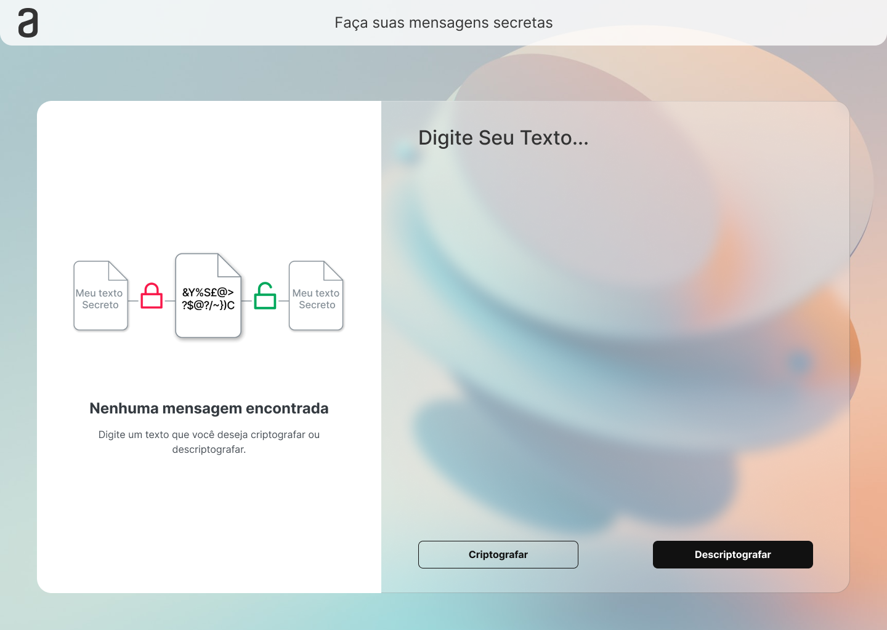

<h1 align="center"> Challenge ONE | Lógica de Programação | Decodificador de texto </h1>

Programa exclusivo e gratuito, promovido pela Alura e Oracle para ensino de tecnologias WEB. #challengeonedecodificador5
 

  <a href="#-tecnologias">Tecnologias</a>&nbsp;&nbsp;&nbsp;|&nbsp;&nbsp;&nbsp;
  <a href="#-projeto">Projeto</a>&nbsp;&nbsp;&nbsp;|&nbsp;&nbsp;&nbsp;
  <a href="#-layout">Layout</a>&nbsp;&nbsp;&nbsp;|&nbsp;&nbsp;&nbsp;
  <a href="#memo-licença">Licença</a>

  

 

  

## 🚀 Tecnologias

Esse projeto foi desenvolvido com as seguintes tecnologias:

- HTML e CSS
- JavaScript
- Git e Github
- Figma

## 💻 Projeto

Se trata de um Decodificador de texto desenvolvido com JavaScript, HTML5 e CSS que criptografa e descriptografa, mensagens digitadas no campo de texto.

- [Acesse o projeto finalizado, online](https://saiko9x.github.io/challanger/)

## 🔖 Layout

O layout de todas as telas do projeto foi feito por mim através da plataforma Figma.

## :memo: Licença

Esse projeto está sob a licença MIT.

---

Feito através da plataforma Alura [Participe da comunidade!](https://discord.gg/QeBdgAjXnn)
